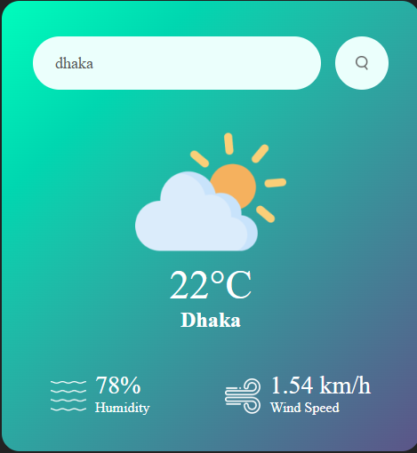

# 🌤️ Weather App

A clean and straightforward web application that lets users check the current weather conditions for any city in the world. Just type a city name, hit search, and get real-time weather data instantly.

The app fetches live data from the OpenWeatherMap API and displays:

* 🌡️ Temperature (°C)
* 💧 Humidity
* 🌬️ Wind Speed
* 🌥️ Weather Condition with Dynamic Icon

Simple, fast, and does exactly what it’s supposed to do — no fluff.

---

## 🚀 Live Demo

👉 **Try it here:**
[https://extraneus.github.io/weatherapp/](https://extraneus.github.io/weatherapp/)

---

## 🖼️ UI Preview



---

## ✨ Features

### 🔎 City Search

Enter any city name to retrieve its current weather details.

### 📡 Real-Time Weather Data

Fetches live weather information including:

* Temperature (in Celsius)
* Humidity percentage
* Wind speed
* Weather condition (Clear, Clouds, Mist, Rain, etc.)

### 🌤️ Dynamic Weather Icons

Weather icons automatically update based on current conditions, making the interface more intuitive and visually engaging.

---

## 🛠️ Technologies Used

* **HTML5** – Provides the structure of the application
* **CSS3** – Handles styling and layout for a clean user interface
* **JavaScript (ES6+)** – Manages API requests and DOM updates
* **OpenWeatherMap API** – Supplies real-time weather data

---

## 📂 Project Structure

```
weatherapp/
│
├── index.html
├── style.css
├── script.js
└── images/
    └── ui.png
```

---

## 📌 How It Works

1. User enters a city name.
2. JavaScript sends a request to the OpenWeatherMap API.
3. The API responds with current weather data.
4. The app dynamically updates the UI with:

   * Temperature
   * Humidity
   * Wind speed
   * Weather condition icon

---

## 🔮 Future Improvements

* Add temperature toggle (°C / °F)
* Add 5-day forecast
* Improve error handling for invalid city names
* Add loading animation for better UX
* Make it fully responsive across all devices


